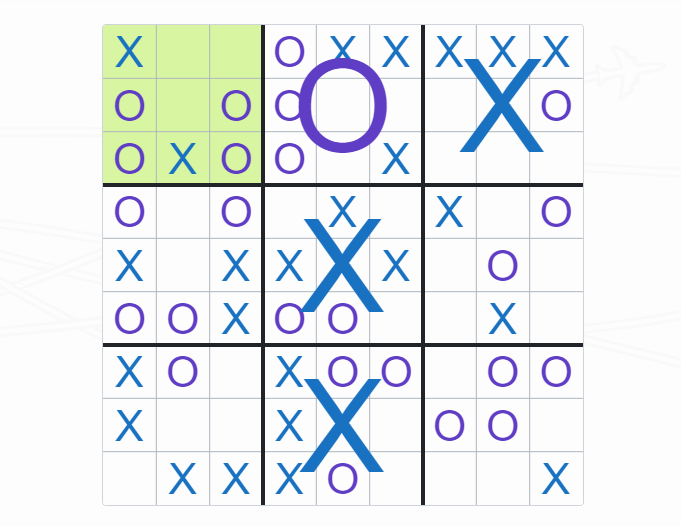

# Ultimate Tic-Tac-Toe



Play the game [here][1]!

## Instructions

Ultimate Tic-Tac-Toe is fairly intuitive and the [rules][3] on Wikipedia are
**much** more confusing than necessary. I recommend learning by playing. In a
nutshell, there is 1 big grid that is controlled by 9 smaller grids. You win by
winning on the big grid.

### Playing against AI

You can configure players via `Config > Update Player X/O > New Game`.

You can also have 2 AIs battle it out!

## Development

### Build

This project is written in TypeScript.
```sh
npm install
npm run build
```

[1]: https://ultimate-tic-tac-toe.jtflabs.dev/
[2]: https://www.typescriptlang.org/download
[3]: https://en.wikipedia.org/wiki/Ultimate_tic-tac-toe#Rules
